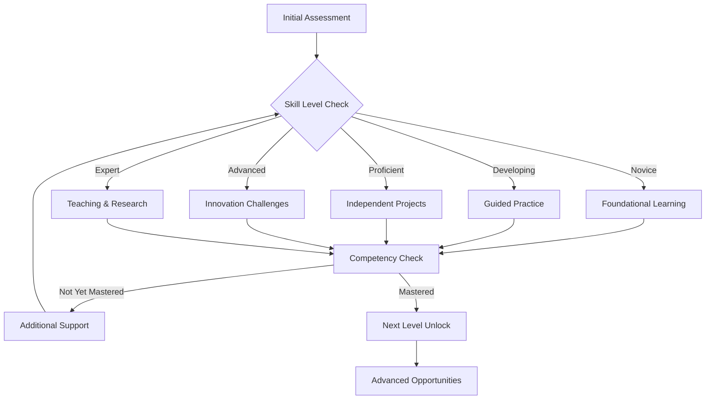

# Assessment and Progress Tracking Framework

## 🎯 Assessment Philosophy
Assessment in Fast Track Academy is **continuous, competency-based, and growth-oriented**. Rather than traditional grades, we measure mastery, progress, and practical application of skills.

## 📊 Multi-Dimensional Assessment Model

### 1. Competency Mastery Levels
```
🔰 Novice     - Beginning to understand basic concepts
🎯 Developing - Can apply concepts with guidance
⭐ Proficient - Independent application of skills
🚀 Advanced   - Can teach others and innovate
🏆 Expert     - Creates new knowledge and solutions
```

### 2. Assessment Categories

#### **Knowledge & Understanding (25%)**
- Factual knowledge retention
- Conceptual understanding
- Theoretical framework comprehension
- Cross-curricular connections

#### **Application & Skills (30%)**
- Practical skill demonstration
- Problem-solving ability
- Tool and technology proficiency
- Real-world application success

#### **Communication & Collaboration (25%)**
- Written communication clarity
- Oral presentation effectiveness
- Collaborative work quality
- Peer teaching and mentoring

#### **Innovation & Creativity (20%)**
- Original thinking and ideas
- Creative problem-solving approaches
- Innovation in project execution
- Artistic and creative expression

## 🛠️ Assessment Tools and Methods

### 1. Digital Portfolio System

#### **Portfolio Components**
- **Project Gallery:** Showcase of completed works with reflections
- **Learning Journal:** Daily/weekly learning reflections and insights
- **Skill Progression Map:** Visual tracking of competency development
- **Peer Feedback Collection:** Comments and reviews from classmates
- **Mentor Assessments:** Formal evaluations from educators and experts

#### **Portfolio Rubric**
```markdown
**Organization & Presentation (20%)**
- Clear navigation and structure
- Professional presentation quality
- Consistent formatting and style
- Accessibility and usability

**Content Quality (40%)**
- Depth of work demonstrated
- Evidence of learning progression
- Quality of reflection and analysis
- Integration of feedback

**Growth Documentation (25%)**
- Clear evidence of skill development
- Honest self-assessment
- Goal setting and achievement
- Learning from challenges

**Innovation & Creativity (15%)**
- Original approaches and ideas
- Creative presentation methods
- Unique project concepts
- Artistic expression quality
```

### 2. Project-Based Assessment

#### **Project Evaluation Matrix**
| Criteria | Novice | Developing | Proficient | Advanced | Expert |
|----------|--------|------------|------------|----------|--------|
| **Technical Implementation** | Basic functionality with significant guidance | Mostly functional with some assistance | Fully functional independently | Optimized and innovative features | Breakthrough implementation |
| **Problem-Solving Process** | Identifies problems with help | Develops solutions with guidance | Creates effective solutions independently | Anticipates and prevents issues | Develops novel problem-solving methods |
| **Research & Analysis** | Uses provided sources | Finds relevant sources with guidance | Conducts thorough independent research | Synthesizes complex information critically | Contributes new insights to field |
| **Communication** | Basic explanation of work | Clear description of process | Compelling presentation of results | Persuasive and engaging delivery | Inspirational thought leadership |

#### **Project Milestone Checkpoints**
- **Week 1:** Project proposal and research plan
- **Week 2:** Initial prototype or proof of concept
- **Week 3:** Mid-project review and iteration planning
- **Week 4:** Near-completion testing and refinement
- **Week 5:** Final presentation and reflection submission

### 3. Competency-Based Skill Assessment

#### **Skill Verification Methods**

##### **Practical Demonstrations**
- Live coding sessions for programming skills
- Laboratory experiments for science concepts
- Design challenges for creative skills
- Presentation delivery for communication skills

##### **Peer Teaching Opportunities**
- Students teach concepts to younger learners
- Create tutorial videos or guides
- Lead study groups or project teams
- Mentor new students in skill areas

##### **Real-World Application**
- Internships or apprenticeships
- Community service projects
- Open-source contributions
- Entrepreneurial ventures

### 4. AI-Enhanced Assessment

#### **Automated Progress Tracking**
- **Learning Analytics Dashboard:** Real-time progress visualization
- **Skill Gap Analysis:** AI identification of areas needing attention
- **Personalized Recommendations:** Suggested next steps and resources
- **Predictive Modeling:** Early warning system for learning challenges

#### **AI-Assisted Feedback**
- **Instant Code Review:** Programming assignment feedback
- **Writing Analysis:** Grammar, style, and structure suggestions
- **Presentation Coaching:** Speech pattern and delivery improvement
- **Research Validation:** Source credibility and fact-checking

## 📈 Progress Tracking Systems

### 1. Individual Learning Dashboard

#### **Daily Metrics**
- Learning hours logged
- Concepts mastered
- Projects advanced
- AI tools utilized
- Peer interactions

#### **Weekly Analysis**
- Skill progression rate
- Challenge areas identified
- Goal achievement status
- Mentor feedback integration
- Next week planning

#### **Monthly Portfolio Review**
- Comprehensive skill assessment
- Project portfolio evaluation
- Peer and self-assessment comparison
- Learning goal adjustment
- Achievement celebration

### 2. Adaptive Learning Pathways

#### **Mastery-Based Progression**
Students advance based on demonstrated competency rather than time spent:



#### **Personalized Learning Analytics**
- **Learning Style Adaptation:** Visual, auditory, kinesthetic preferences
- **Pace Optimization:** Accelerated or supportive timing adjustments
- **Interest Alignment:** Project choices matching student passions
- **Challenge Calibration:** Optimal difficulty level maintenance

### 3. Collaborative Assessment

#### **Peer Review Process**
- **Project Presentations:** Student-led demonstrations and feedback
- **Code Reviews:** Programming project evaluation by peers
- **Creative Critiques:** Artistic work analysis and suggestions
- **Research Validation:** Fact-checking and source verification

#### **Group Project Assessment**
```markdown
**Individual Contribution (40%)**
- Personal work quality and quantity
- Reliability and timeliness
- Initiative and leadership
- Problem-solving contributions

**Collaboration Skills (35%)**
- Communication effectiveness
- Conflict resolution ability
- Support provided to teammates
- Integration of different perspectives

**Group Outcome (25%)**
- Final project quality
- Achievement of group goals
- Presentation effectiveness
- Innovation and creativity
```

## 🎯 Competency Framework

### Core Competency Categories

#### **1. Foundational Literacies**
- **Reading & Writing:** Advanced literacy across genres and media
- **Mathematical Reasoning:** Applied mathematics and logical thinking
- **Scientific Method:** Hypothesis testing and evidence evaluation
- **Digital Fluency:** Technology use and computational thinking
- **Financial Literacy:** Economic understanding and money management
- **Cultural Awareness:** Global perspectives and diversity appreciation

#### **2. 21st Century Skills**
- **Critical Thinking:** Analysis, evaluation, and synthesis
- **Creative Problem-Solving:** Innovation and design thinking
- **Communication:** Multimodal expression and active listening
- **Collaboration:** Teamwork and collective intelligence
- **Adaptability:** Flexibility and resilience in change
- **Self-Direction:** Goal setting and autonomous learning

#### **3. Specialized Competencies**
- **Technical Skills:** Programming, engineering, design, etc.
- **Artistic Expression:** Visual, musical, literary, and performing arts
- **Leadership:** Vision, influence, and team building
- **Entrepreneurship:** Innovation, risk-taking, and value creation
- **Research:** Information gathering, analysis, and synthesis
- **Teaching:** Knowledge transfer and mentoring

### Competency Assessment Rubric

#### **Evidence Collection Requirements**
For each competency level, students must demonstrate:

**Novice → Developing**
- Basic knowledge demonstration through quizzes or discussions
- Completion of guided practice activities
- Participation in collaborative learning experiences

**Developing → Proficient**
- Independent application in structured projects
- Successful peer teaching or tutoring sessions
- Problem-solving in novel but similar contexts

**Proficient → Advanced**
- Innovation or improvement in existing solutions
- Leadership in complex group projects
- Mentoring of less experienced learners

**Advanced → Expert**
- Original research or creative contributions
- Community impact through applied projects
- Recognition from external experts or organizations

## 📋 Assessment Calendar

### Daily Assessment Activities
- **Morning Goal Setting:** Daily learning objectives and priorities
- **Progress Check-ins:** Mid-day reflection and adjustment
- **Evening Reflection:** Learning consolidation and next-day planning
- **Peer Feedback:** Collaborative assessment and support

### Weekly Assessment Cycles
- **Monday:** Week planning and goal setting
- **Wednesday:** Mid-week progress review and adjustment
- **Friday:** Week completion reflection and portfolio update
- **Continuous:** Project work and milestone tracking

### Monthly Assessment Reviews
- **Week 1:** Comprehensive skill assessment and portfolio review
- **Week 2:** Goal adjustment and learning path optimization
- **Week 3:** Peer assessment and collaborative project evaluation
- **Week 4:** Celebration of achievements and future planning

### Quarterly Assessment Events
- **Public Portfolio Presentations:** Student-led showcase of learning
- **Competency Certification:** Formal recognition of mastered skills
- **Goal Setting Conferences:** Student-mentor-parent planning sessions
- **Community Impact Assessment:** Real-world application evaluation

## 🔄 Continuous Improvement Process

### Assessment Effectiveness Review
- **Student Feedback Collection:** Regular surveys on assessment quality
- **Learning Outcome Analysis:** Correlation between assessment and achievement
- **Mentor Training Updates:** Improving assessment consistency and quality
- **Technology Enhancement:** Upgrading tools and analytics capabilities

### Adaptive Assessment Design
- **Personalization Algorithms:** AI-driven assessment customization
- **Real-Time Adjustment:** Dynamic difficulty and support modifications
- **Predictive Analytics:** Early intervention for learning challenges
- **Success Pattern Recognition:** Identifying optimal learning pathways

---

*Assessment in Fast Track Academy is not about judgment but about growth, understanding, and empowerment. Every assessment is an opportunity to learn, improve, and celebrate progress.*